<!-- Generated by tools/profile/render.py — edit that file, not this one. -->

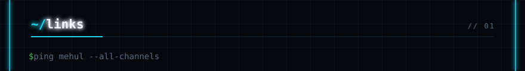

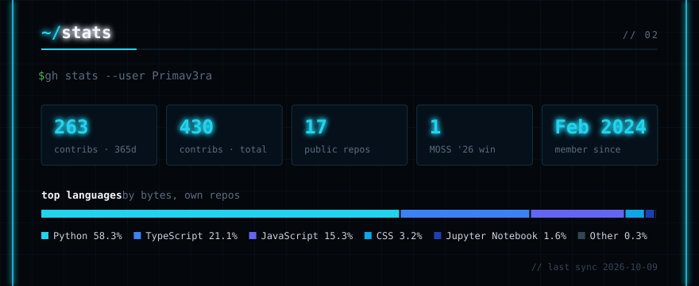
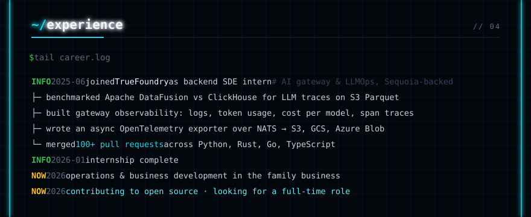
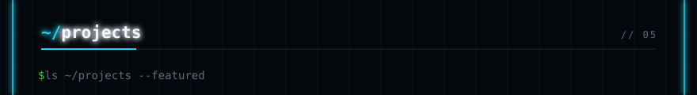
<a href="https://github.com/Harigithub11/Mantis">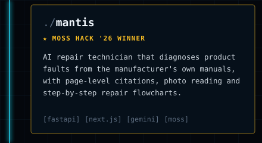</a><a href="https://github.com/Primav3ra/SOLARIS-Rooftop-Solar-Mapping">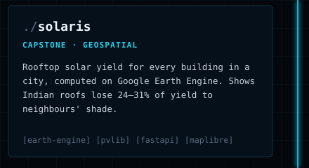</a>
<a href="https://github.com/Primav3ra/MehuLLM">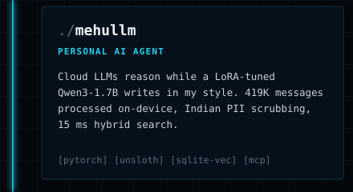</a><a href="https://github.com/Primav3ra/Construction-Intelligence-Map">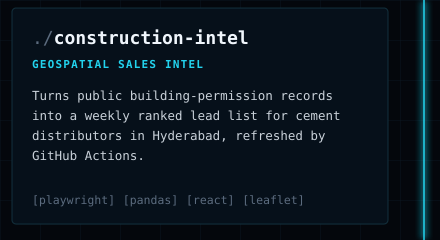</a>
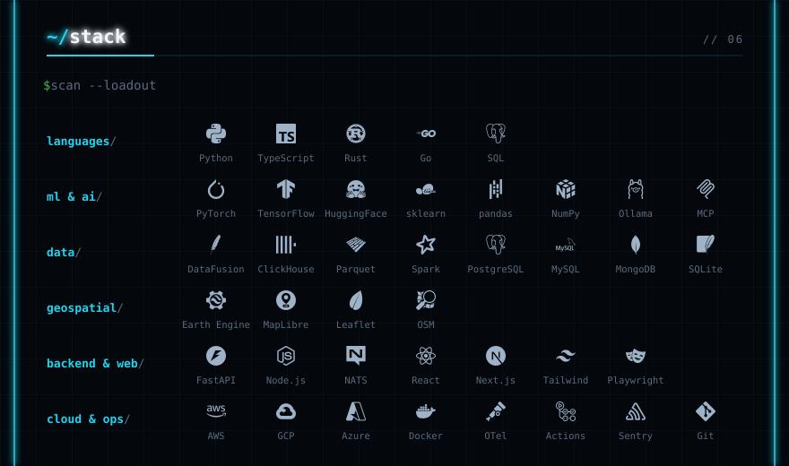
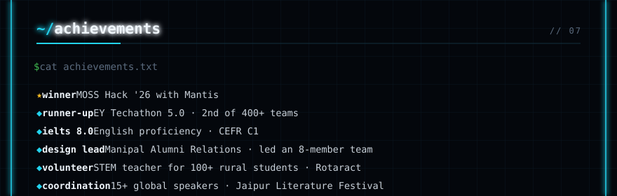

