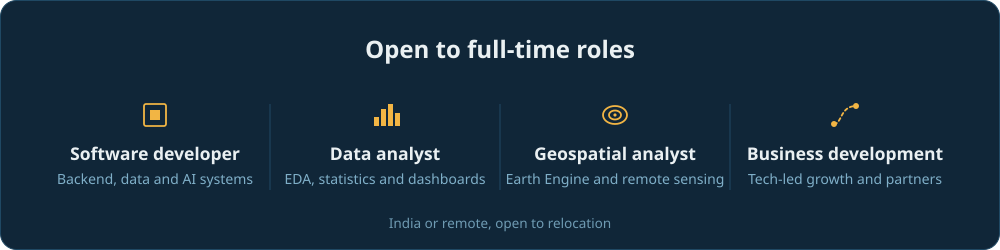
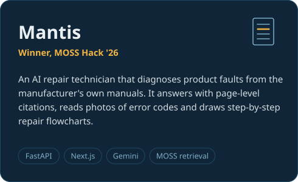
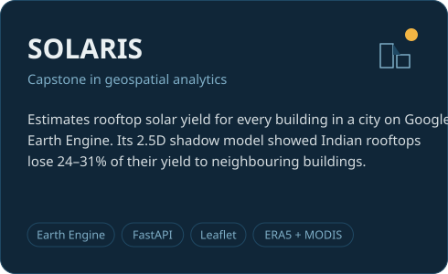
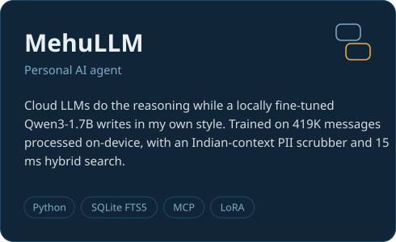
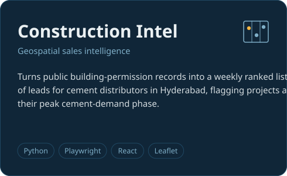
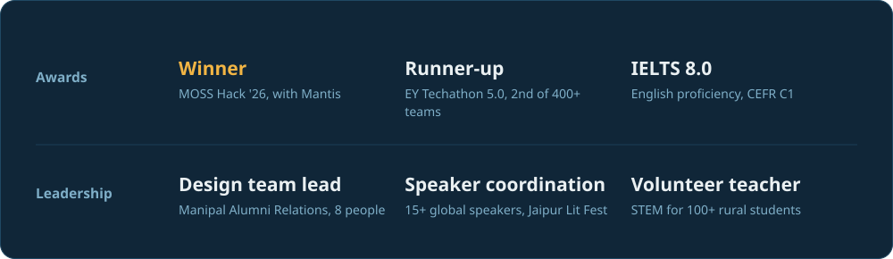

&nbsp;&nbsp;

I'm a Data Science graduate from Manipal University Jaipur (2026, 8.33 CGPA). I like problems where backend engineering, data and business decisions meet. At <b>TrueFoundry</b>, a Sequoia-backed LLMOps company, I built observability for their AI Gateway and merged <b>100+ pull requests</b> across Python, Rust, Go and TypeScript.

Today I help run operations and business development in my family's business, and I spend my engineering time on <b>open-source contributions</b>. I'm looking for a corporate role where I can build the systems and help shape the decisions around them.

 

  

<h3 align="center">Experience</h3>

  

<h3 align="center">Selected projects</h3>

&nbsp;

&nbsp;

 

<h3 align="center">Tech stack</h3>

  

<h3 align="center">Awards and leadership</h3>

  

<h3 align="center">Get in touch</h3>

&nbsp;&nbsp;

